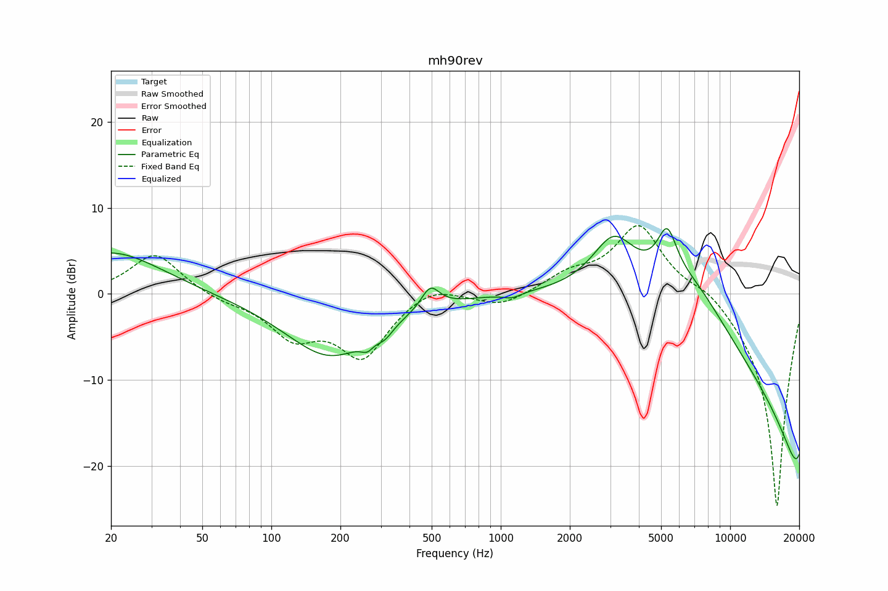

# mh90rev
See [usage instructions](https://github.com/jaakkopasanen/AutoEq#usage) for more options and info.

### Parametric EQs
In case of using parametric equalizer, apply preamp of **-7.8dB** and build filters manually
with these parameters. The first 5 filters can be used independently.
When using independent subset of filters, apply preamp of **-7.1 dB**.

| Type    | Fc       |    Q | Gain     |
|:--------|:---------|:-----|:---------|
| Peaking | 20 Hz    | 0.65 | 4.9 dB   |
| Peaking | 180 Hz   | 0.71 | -7.2 dB  |
| Peaking | 1121 Hz  | 3.68 | -0.6 dB  |
| Peaking | 3106 Hz  | 1.48 | 6.3 dB   |
| Peaking | 5312 Hz  | 3.23 | 5.3 dB   |
| Peaking | 262 Hz   | 5.18 | -1.0 dB  |
| Peaking | 312 Hz   | 3.86 | -1.1 dB  |
| Peaking | 493 Hz   | 3.53 | 2.6 dB   |
| Peaking | 6759 Hz  | 0.83 | 4.8 dB   |
| Peaking | 19338 Hz | 0.22 | -19.2 dB |

### Fixed Band EQs
In case of using fixed band (also called graphic) equalizer, apply preamp of **-8.1dB**
(if available) and set gains manually with these parameters.

| Type    | Fc       |    Q | Gain     |
|:--------|:---------|:-----|:---------|
| Peaking | 31 Hz    | 1.41 | 4.6 dB   |
| Peaking | 62 Hz    | 1.41 | -0.7 dB  |
| Peaking | 125 Hz   | 1.41 | -4.5 dB  |
| Peaking | 250 Hz   | 1.41 | -7.0 dB  |
| Peaking | 500 Hz   | 1.41 | 1.4 dB   |
| Peaking | 1000 Hz  | 1.41 | -1.5 dB  |
| Peaking | 2000 Hz  | 1.41 | 2.0 dB   |
| Peaking | 4000 Hz  | 1.41 | 8.1 dB   |
| Peaking | 8000 Hz  | 1.41 | 1.4 dB   |
| Peaking | 16000 Hz | 1.41 | -24.8 dB |

### Graphs
