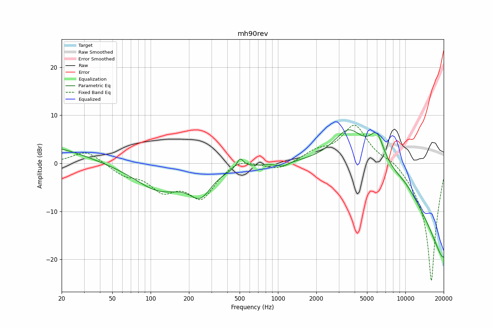

# mh90rev2 - 4db bass boost
See [usage instructions](https://github.com/jaakkopasanen/AutoEq#usage) for more options and info.

### Parametric EQs
In case of using parametric equalizer, apply preamp of **-7.2dB** and build filters manually
with these parameters. The first 5 filters can be used independently.
When using independent subset of filters, apply preamp of **-7.3 dB**.

| Type    | Fc       |    Q | Gain    |
|:--------|:---------|:-----|:--------|
| Peaking | 15 Hz    | 0.49 | 3.7 dB  |
| Peaking | 118 Hz   | 0.73 | -5.4 dB |
| Peaking | 246 Hz   | 1.63 | -5.1 dB |
| Peaking | 1087 Hz  | 3.07 | -0.9 dB |
| Peaking | 3590 Hz  | 1.15 | 7.1 dB  |
| Peaking | 505 Hz   | 5.45 | 2.0 dB  |
| Peaking | 5978 Hz  | 2.37 | 5.8 dB  |
| Peaking | 9957 Hz  | 1.28 | 1.2 dB  |
| Peaking | 19643 Hz | 0.18 | -9.6 dB |
| Peaking | 19848 Hz | 0.26 | -9.9 dB |

### Fixed Band EQs
In case of using fixed band (also called graphic) equalizer, apply preamp of **-8.1dB**
(if available) and set gains manually with these parameters.

| Type    | Fc       |    Q | Gain     |
|:--------|:---------|:-----|:---------|
| Peaking | 31 Hz    | 1.41 | 2.7 dB   |
| Peaking | 62 Hz    | 1.41 | -2.1 dB  |
| Peaking | 125 Hz   | 1.41 | -4.9 dB  |
| Peaking | 250 Hz   | 1.41 | -6.8 dB  |
| Peaking | 500 Hz   | 1.41 | 1.5 dB   |
| Peaking | 1000 Hz  | 1.41 | -1.5 dB  |
| Peaking | 2000 Hz  | 1.41 | 2.0 dB   |
| Peaking | 4000 Hz  | 1.41 | 8.0 dB   |
| Peaking | 8000 Hz  | 1.41 | 1.5 dB   |
| Peaking | 16000 Hz | 1.41 | -24.6 dB |

### Graphs

